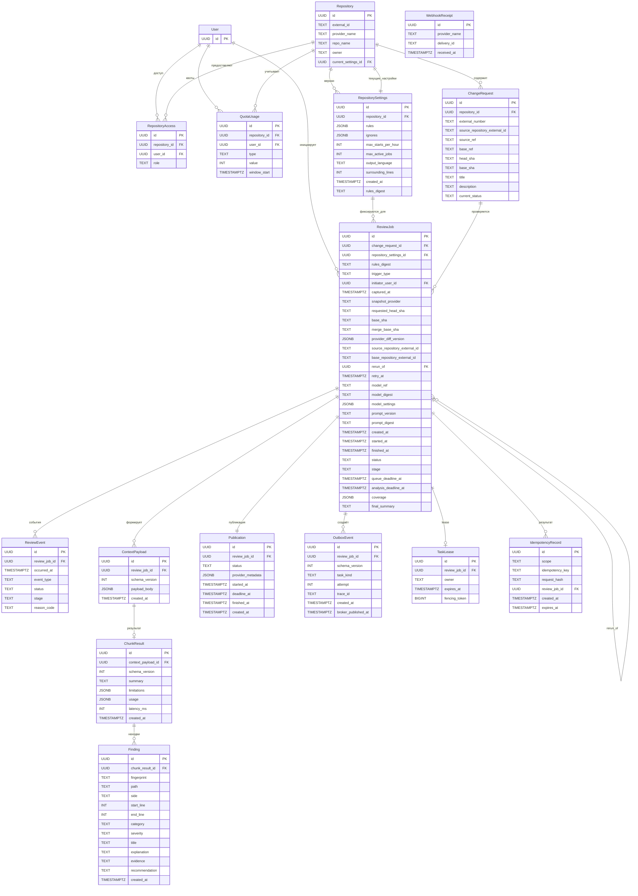

# ERD backend — DMC-268 API (Team 2)

**Статус:** схема хранения данных для предметного ядра backend.  
**Основание:** актуальный `SYSTEM_DESIGN.md` и модель данных backend.

---

## 1. Назначение

Схема описывает долговременное состояние процесса AI-review: настройки repository, Change Request, lifecycle ReviewJob, контекст и результаты LLM, Finding, состояние публикации, transactional outbox, lease, idempotency и квоты.

---

## 2. ERD

---

## 3. Кардинальности и ограничения

| Объект | Ограничение |
| --- | --- |
| Repository → ChangeRequest | `1:N` |
| ChangeRequest → ReviewJob | `1:N` |
| ReviewJob → ContextPayload | `1:N` |
| ContextPayload → ChunkResult | `1:0..1`, `UNIQUE(context_payload_id)` |
| ChunkResult → Finding | `1:N` |
| ReviewJob → Publication | `1:1`, `UNIQUE(review_job_id)` |
| ReviewJob → TaskLease | `1:0..1`, `UNIQUE(review_job_id)` |
| ReviewJob → OutboxEvent | `1:N` |
| RepositoryAccess | `UNIQUE(repository_id, user_id)` |
| ChangeRequest | `UNIQUE(repository_id, external_number)` |
| WebhookReceipt | `UNIQUE(provider_name, delivery_id)` |
| IdempotencyRecord | `UNIQUE(scope, idempotency_key)` |

Допустимые значения:

- `ReviewJob.status`: `QUEUED | RUNNING | COMPLETED | PARTIAL | FAILED | SKIPPED`;
- `ReviewJob.stage`: `snapshot | context | inference | validation | done | NULL`;
- `Publication.status`: `NOT_READY | PENDING | PUBLISHED | PARTIAL | FAILED | UNKNOWN | SKIPPED`;
- `Finding.side`: `OLD | NEW`;
- `Finding.category`: `security | correctness | performance | maintainability`;
- `Finding.severity`: `critical | high | medium | low`;
- `OutboxEvent.task_kind`: `analyze | publish`;
- `QuotaUsage.type`: `starts | active_jobs`;
- `RepositoryAccess.role`: `reviewer | admin`.

---

## 4. JSONB

Поля JSONB:

- `ReviewJob.model_settings`;
- `ReviewJob.provider_diff_version`;
- `ReviewJob.coverage`;
- `ContextPayload.payload_body`;
- `ChunkResult.limitations`;
- `ChunkResult.usage`;
- `Publication.provider_metadata`;
- `RepositorySettings.rules`;
- `RepositorySettings.ignores`.

`ContextPayload.payload_body` содержит `snapshot`, `metadata`, `files`, `related_symbols`, `coverage`, `budget`. Значения `review_id`, `chunk_id` и `schema_version` представлены отдельными колонками `review_job_id`, `id`, `schema_version`.

---

## 5. Индексы

- `review_job(status, retry_at)` — выбор ReviewJob для recovery;
- `outbox_event(broker_published_at, created_at)` — выбор событий dispatcher;
- `task_lease(expires_at)` — выбор истёкших lease;
- `idempotency_record(expires_at)` — удаление истёкших записей;
- частичный уникальный индекс для `QuotaUsage(type='starts')` по `repository_id, user_id, type, window_start`;
- частичный уникальный индекс для `QuotaUsage(type='active_jobs')` по `repository_id, type`.

---

## 6. Открытые вопросы

- структура `ReviewJob.error/reason`;
- семантика `Repository.enabled`;
- место хранения GitHub `installation_id`;
- JSON schema для `RepositorySettings.rules/ignores`;
- модель хранения OAuth/access для `User`;
- необходимость `ChunkResult.schema_version` после окончательной сверки с canonical review-result schema.

---

## 7. Именование SQL

Идентификаторы SQL используют `snake_case`: `ReviewJob` → `review_job`, `review_job_id`; `RepositorySettings` → `repository_settings`.
