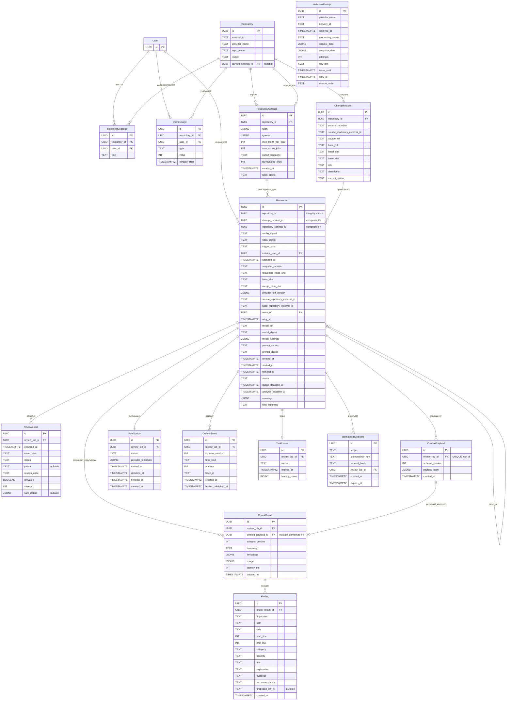

# ERD backend — DMC-268 API (Team 2)

**Основание:** актуальный `SYSTEM_DESIGN.md` и модель данных backend.

---

## 1. Назначение

Схема описывает долговременное состояние процесса AI-review: настройки repository, Change Request, lifecycle ReviewJob, контекст и результаты LLM, Finding, состояние публикации, transactional outbox, lease, idempotency и квоты.

---

## 2. ERD

```mermaid
erDiagram
    User ||--o{ RepositoryAccess : доступ
    User ||--o{ QuotaUsage : квоты
    User ||--o{ ReviewJob : инициирует

    Repository ||--o{ RepositoryAccess : предоставляет
    Repository ||--o{ RepositorySettings : версии
    Repository ||--o{ QuotaUsage : учитывает
    Repository ||--o{ ChangeRequest : содержит
    RepositorySettings ||--o{ ReviewJob : фиксируются_для
    Repository ||--o| RepositorySettings : текущие_настройки

    ChangeRequest ||--o{ ReviewJob : проверяется
    ReviewJob ||--o{ ReviewEvent : события
    ReviewJob ||--o{ ContextPayload : формирует
    ReviewJob ||--o{ ChunkResult : сохраняет_результаты
    ReviewJob ||--|| Publication : публикация
    ReviewJob ||--o{ OutboxEvent : создаёт
    ReviewJob ||--o| TaskLease : lease
    ReviewJob ||--o{ IdempotencyRecord : результат
    ReviewJob ||--o{ ReviewJob : rerun_of

    ContextPayload o|--o| ChunkResult : исходный_контекст
    ChunkResult ||--o{ Finding : находки

    Repository {
        UUID id PK
        TEXT external_id
        TEXT provider_name
        TEXT repo_name
        TEXT owner
        UUID current_settings_id FK "nullable"
    }

    ChangeRequest {
        UUID id PK
        UUID repository_id FK
        TEXT external_number
        TEXT source_repository_external_id
        TEXT source_ref
        TEXT base_ref
        TEXT head_sha
        TEXT base_sha
        TEXT title
        TEXT description
        TEXT current_status
    }

    ReviewJob {
        UUID id PK
        UUID repository_id "integrity anchor"
        UUID change_request_id "composite FK"
        UUID repository_settings_id "composite FK"
        TEXT config_digest
        TEXT rules_digest
        TEXT trigger_type
        UUID initiator_user_id FK
        TIMESTAMPTZ captured_at
        TEXT snapshot_provider
        TEXT requested_head_sha
        TEXT base_sha
        TEXT merge_base_sha
        JSONB provider_diff_version
        TEXT source_repository_external_id
        TEXT base_repository_external_id
        UUID rerun_of FK
        TIMESTAMPTZ retry_at
        TEXT model_ref
        TEXT model_digest
        JSONB model_settings
        TEXT prompt_version
        TEXT prompt_digest
        TIMESTAMPTZ created_at
        TIMESTAMPTZ started_at
        TIMESTAMPTZ finished_at
        TEXT status
        TIMESTAMPTZ queue_deadline_at
        TIMESTAMPTZ analysis_deadline_at
        JSONB coverage
        TEXT final_summary
    }

    ReviewEvent {
        UUID id PK
        UUID review_job_id FK
        TIMESTAMPTZ occurred_at
        TEXT event_type
        TEXT status
        TEXT phase "nullable"
        TEXT reason_code
        BOOLEAN retryable
        INT attempt
        JSONB safe_details "nullable"
    }

    ContextPayload {
        UUID id PK
        UUID review_job_id FK "UNIQUE with id"
        INT schema_version
        JSONB payload_body
        TIMESTAMPTZ created_at
    }

    ChunkResult {
        UUID id PK
        UUID review_job_id FK
        UUID context_payload_id FK "nullable, composite FK"
        INT schema_version
        TEXT summary
        JSONB limitations
        JSONB usage
        INT latency_ms
        TIMESTAMPTZ created_at
    }

    Finding {
        UUID id PK
        UUID chunk_result_id FK
        TEXT fingerprint
        TEXT path
        TEXT side
        INT start_line
        INT end_line
        TEXT category
        TEXT severity
        TEXT title
        TEXT explanation
        TEXT evidence
        TEXT recommendation
        TEXT proposed_diff_fix "nullable"
        TIMESTAMPTZ created_at
    }

    Publication {
        UUID id PK
        UUID review_job_id FK
        TEXT status
        JSONB provider_metadata
        TIMESTAMPTZ started_at
        TIMESTAMPTZ deadline_at
        TIMESTAMPTZ finished_at
        TIMESTAMPTZ created_at
    }

    OutboxEvent {
        UUID id PK
        UUID review_job_id FK
        INT schema_version
        TEXT task_kind
        INT attempt
        TEXT trace_id
        TIMESTAMPTZ created_at
        TIMESTAMPTZ broker_published_at
    }

    TaskLease {
        UUID id PK
        UUID review_job_id FK
        TEXT owner
        TIMESTAMPTZ expires_at
        BIGINT fencing_token
    }

    RepositoryAccess {
        UUID id PK
        UUID repository_id FK
        UUID user_id FK
        TEXT role
    }

    RepositorySettings {
        UUID id PK
        UUID repository_id FK
        JSONB rules
        JSONB ignores
        INT max_starts_per_hour
        INT max_active_jobs
        TEXT output_language
        INT surrounding_lines
        TIMESTAMPTZ created_at
        TEXT rules_digest
    }

    QuotaUsage {
        UUID id PK
        UUID repository_id FK
        UUID user_id FK
        TEXT type
        INT value
        TIMESTAMPTZ window_start
    }

    User {
        UUID id PK
    }

    WebhookReceipt {
        UUID id PK
        TEXT provider_name
        TEXT delivery_id
        TIMESTAMPTZ received_at
        TEXT processing_status
        JSONB request_data
        JSONB snapshot_data
        INT attempts
        TEXT raw_diff
        TIMESTAMPTZ lease_until
        TIMESTAMPTZ retry_at
        TEXT reason_code
    }

    IdempotencyRecord {
        UUID id PK
        TEXT scope
        TEXT idempotency_key
        TEXT request_hash
        UUID review_job_id FK
        TIMESTAMPTZ created_at
        TIMESTAMPTZ expires_at
    }
```

---

## 3. Кардинальности и ограничения

| Объект                       | Ограничение                              |
| ---------------------------- | ---------------------------------------- |
| Repository                   | `UNIQUE(provider_name, external_id)`     |
| Repository → current settings | `0..1`; composite FK `(id, current_settings_id) → RepositorySettings(repository_id, id)` |
| RepositorySettings           | `UNIQUE(repository_id, id)` for composite references |
| Repository → ChangeRequest   | `1:N`                                    |
| ChangeRequest                | `UNIQUE(repository_id, external_number)` and `UNIQUE(repository_id, id)` |
| ChangeRequest → ReviewJob    | `1:N`                                    |
| ReviewJob repository/settings | composite FKs require ChangeRequest and frozen RepositorySettings to belong to `ReviewJob.repository_id` |
| ReviewJob → ContextPayload   | `1:N`                                    |
| ReviewJob → ChunkResult      | `1:N`; durable result ownership          |
| ContextPayload | `UNIQUE(review_job_id, id)` for composite reference |
| ContextPayload → ChunkResult | `1:0..1`; nullable `UNIQUE(context_payload_id)`, composite FK `(review_job_id, context_payload_id) → ContextPayload(review_job_id, id)`, `ON DELETE SET NULL (context_payload_id)` |
| ChunkResult → Finding        | `1:N`                                    |
| ReviewJob → Publication      | `1:1`, `UNIQUE(review_job_id)`           |
| ReviewJob → TaskLease        | `1:0..1`, `UNIQUE(review_job_id)`        |
| ReviewJob → OutboxEvent      | `1:N`                                    |
| RepositoryAccess             | `UNIQUE(repository_id, user_id)`         |
| WebhookReceipt               | `UNIQUE(provider_name, delivery_id)`     |
| IdempotencyRecord            | `UNIQUE(scope, idempotency_key)`         |

Текущий GitHub connection flow использует существующие `Repository` и
`RepositoryAccess`, а не отдельную таблицу подключения. `Repository` уникален
по provider/external ID; связь `(repository_id, user_id)` создаётся атомарно
после проверки актуального GitHub доступа. Role backend выводит из provider
permissions. Новому repository создаётся первая settings version, но повторное
подключение другого или того же пользователя не переписывает существующие
settings и их frozen references. `GET /repositories` выбирает только связи
текущего пользователя; наличие строки Repository само по себе не даёт доступ.

Допустимые значения:

- `ReviewJob.status`: `QUEUED | FETCHING_DIFF | PARSING_CONTEXT | LLM_PROCESSING | COMPLETED | PARTIAL | FAILED | SKIPPED`;
- `ReviewEvent.phase`: `FETCHING_DIFF | PARSING_CONTEXT | LLM_PROCESSING | NULL`;
- `Publication.status`: `NOT_READY | PENDING | PUBLISHED | PARTIAL | FAILED | UNKNOWN | SKIPPED`;
- `Finding.side`: `OLD | NEW`;
- `Finding.category`: `security | correctness | performance | maintainability`;
- `Finding.severity`: `critical | high | medium | low`;
- `OutboxEvent.task_kind`: `analyze | publish`;
- `QuotaUsage.type`: `starts | active_jobs`;
- `RepositoryAccess.role`: `reviewer | admin`.

Именованный CHECK `ck_review_job_status_finished_at` использует
`ReviewJob.finished_at` как DB-маркер активности. Статусы `QUEUED`,
`FETCHING_DIFF`, `PARSING_CONTEXT` и `LLM_PROCESSING` требуют
`finished_at IS NULL`; `COMPLETED`, `PARTIAL`, `FAILED` и `SKIPPED` требуют
`finished_at IS NOT NULL`. Terminal-переход записывает status и
`finished_at` одним SQL `UPDATE` или ORM flush: CHECK проверяется после каждого
statement, одной транзакции с двумя отдельными обновлениями недостаточно.
Отдельного current/public `stage` нет.

`Repository.current_settings_id` изначально равен `NULL`. После создания первой
версии настроек составной FK разрешает назначить только настройки того же
repository. Исторический `ReviewJob.repository_settings_id` остаётся неизменным,
когда current settings переходит на новую версию. FK immediate, не deferred.
SQLAlchemy `use_alter` разрывает только DDL-цикл создания таблиц из-за двух
встречных repository/settings ссылок; данные создаются через nullable-then-update.

`ReviewJob.config_digest` — SHA-256 детерминированного JSON ровно из
`repository_settings_id`, `rules_digest`, `model_ref`, nullable `model_digest`,
`model_settings`, `prompt_version` и `prompt_digest`. Идентификаторы run/snapshot
и lifecycle/result поля исключены.

После retention cleanup `ChunkResult.context_payload_id` становится `NULL`;
долговременный путь — `ReviewJob -> ChunkResult -> Finding`. Если context указан,
составной FK `fk_chunk_result_context_payload_same_review` требует совпадения
`review_job_id` у результата и context. При удалении context PostgreSQL обнуляет
только `context_payload_id`, сохраняя владельца результата. Миграция `0003` после
`0002` добавляет это ограничение без изменения старой миграции. При наличии
несогласованных исторических строк создание FK завершается ошибкой и транзакция
миграции откатывается без исправления данных.

---

## 4. JSONB

Поля JSONB:

- `ReviewJob.model_settings`;
- `ReviewJob.provider_diff_version`;
- `ReviewJob.coverage`;
- `ContextPayload.payload_body`;
- `ChunkResult.limitations`;
- `ChunkResult.usage`;
- `ReviewEvent.safe_details`;
- `Publication.provider_metadata`;
- `RepositorySettings.rules`;
- `RepositorySettings.ignores`.

`ContextPayload.payload_body` содержит `snapshot`, `metadata`, `files`,
`related_symbols`, `coverage`, `budget`, но не дублирует `review_id`, `chunk_id`
или `schema_version`. Их authoritative значения находятся в колонках
`review_job_id`, `id`, `schema_version`. Полный wire payload по
`schemas/context/v1.json` собирается из этих колонок и body перед валидацией
и вызовом LLM; при записи body валидируется без доверия к идентификаторам из
внешнего JSON. Application value `BuiltContextPayload` содержит body, версию,
`review_id` и `chunk_id`; `to_wire()` отклоняет envelope-поля в body и собирает
wire payload из этих значений.
`metadata.output_language` в wire context может сохранить непустой язык
исторической версии; новые версии настроек принимают только `ru`.

Миграция `0005_github_webhook_inbox` расширяет существующий `WebhookReceipt`
для GitHub-only intake. `request_data` хранит выбранные поля PR и frozen
`ignore_globs`, `snapshot_data` — Level 1 artifact, `raw_diff` — исходный diff.
Это не `ContextPayload`: запись receipt не создаёт ReviewJob и может иметь
пустой список файлов. `processing_status` принимает application-состояния
`PENDING`, `PROCESSING`, `READY`, `FAILED`, `IGNORED` (legacy default);
`attempts` ограничиваются
worker-политикой (максимум три), lease — 90 секунд, `retry_at` и `reason_code`
сохраняют recovery decision. Детали HTTP и worker — в
[`github-webhook-intake.md`](./github-webhook-intake.md).

`ChunkResult.limitations` содержит JSON array строк. `usage` nullable и при
наличии содержит только non-negative `input_tokens` и `output_tokens`. Finding
сохраняет nullable `proposed_diff_fix`; это предложение никогда не применяется
автоматически.

Миграция `0004` идёт после `0003_result_context_ownership`. Она не меняет
существующие `RepositorySettings.rules`, `ignores`, `rules_digest`,
`output_language`, а также frozen settings/digests в ReviewJob. Legacy `{}`
проецируется на чтении как пустые canonical rules/ignores без UPDATE; исходный
`output_language` старой версии, включая не-`ru`, возвращается без подмены.
Сохранённый `rules_digest` не пересчитывается. Иные noncanonical legacy
settings дают `GET /settings` ответ `409 LEGACY_SETTINGS_UNSUPPORTED` с opaque
ETag и новый start `409` до quota/outbox; принятые jobs и idempotency replay
остаются на frozen версии. Admin full canonical PUT с `If-Match` атомарно
создаёт новую `ru`-версию и переключает current pointer без наследования
старого JSON.

Для `ChunkResult.limitations` миграция `0004` переводит legacy `{}` в `[]` и
ровно `{"warnings": [<строки>]}` в массив тех же строк; `usage={}` становится
`NULL`. Неизвестная непустая JSON-форма останавливает upgrade на preflight с
идентификатором записи и инструкцией оператору, без содержимого JSON; вся
миграция откатывается. Preflight и преобразование выполняются в одной
транзакции после раннего
`LOCK TABLE review_job, chunk_result IN ACCESS EXCLUSIVE MODE`, чтобы запись
не прошла между проверкой и обновлением. Перед
deployment нужно остановить старые writes/workers; длительность ожидания lock
ограничивает операторский timeout. При downgrade `limitations=[]` становится
`{}`, а непустой массив строк становится `{"warnings": [строки]}` без потери строк.
Legacy `ReviewEvent.reason_code` сохраняется в audit-БД:
новые записи используют ограниченный enum, неизвестный исторический код в
публичной проекции становится `null`, не raw-текстом.

Legacy `ReviewJob.status=RUNNING` преобразуется по stage в новый active status;
`ReviewEvent.stage` становится `phase` с отображением snapshot/context/inference/
validation на active phase, а done на `NULL`. Downgrade status/phase намеренно
теряет различие исходных `validation` и `done`; frozen settings остаются
нетронутыми и при downgrade.

Новые `RepositorySettings.rules` имеют canonical форму
`{"instructions": []}`, а `ignores` — `{"globs": []}`. Строки уникальны и
непусты; порядок instructions семантически значим. Globs — normalized
repository-relative POSIX patterns без absolute path, `..`, backslash, NUL и
negation. `rules_digest` создаёт backend из canonical serialization при записи
новой версии, но исторический digest не пересчитывается.

---

## 5. Индексы

- `review_job(status, retry_at)` — выбор ReviewJob для recovery;
- partial `UNIQUE(change_request_id, requested_head_sha, config_digest) WHERE finished_at IS NULL`
  — не более одного незавершённого эквивалентного запуска; завершённые запуски не
  блокируют rerun;
- `outbox_event(broker_published_at, created_at)` — выбор событий dispatcher;
- `task_lease(expires_at)` — выбор истёкших lease;
- `idempotency_record(expires_at)` — удаление истёкших записей;
- частичный уникальный индекс для `QuotaUsage(type='starts')` по `repository_id, user_id, type, window_start`;
- частичный уникальный индекс для `QuotaUsage(type='active_jobs')` по `repository_id, type`.

---

## 6. Отложенная реализация

- семантика `Repository.enabled`;
- место хранения GitHub `installation_id`;
- физическая модель OAuth identity/access и обязательного PostgreSQL
  `AuthSession`; accepted контракт требует 30-минутную JWT cookie с уникальным
  `sid`, server-side revocation и CSRF verifier. Refresh продлевает только
  действующую unexpired session атомарно с выдачей cookie на тот же `sid` и
  сохранением CSRF token; отдельный refresh token не нужен;
- HTTP adapters для provider-backed списка доступных repository, атомарного
  подключения и session refresh по `openapi.yaml`;
- полные worker/dispatcher/recovery adapters.

---

## 7. Именование SQL

Идентификаторы SQL используют `snake_case`: `ReviewJob` → `review_job`, `review_job_id`; `RepositorySettings` → `repository_settings`.
