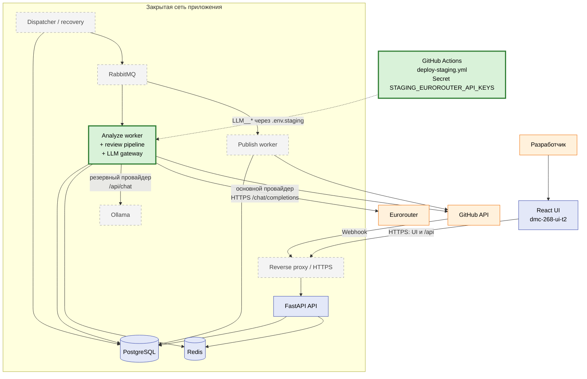
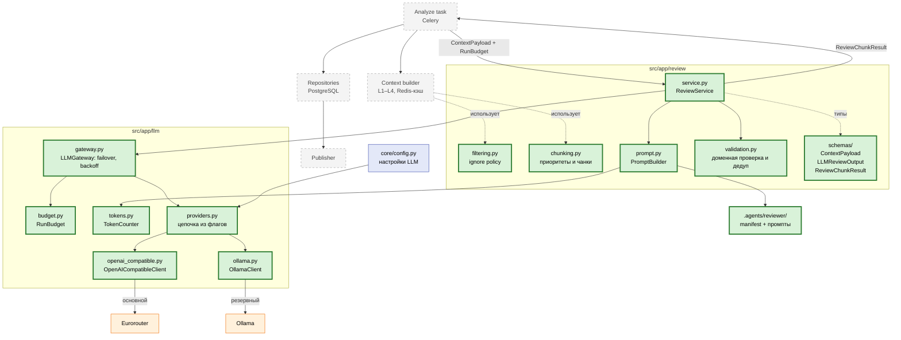
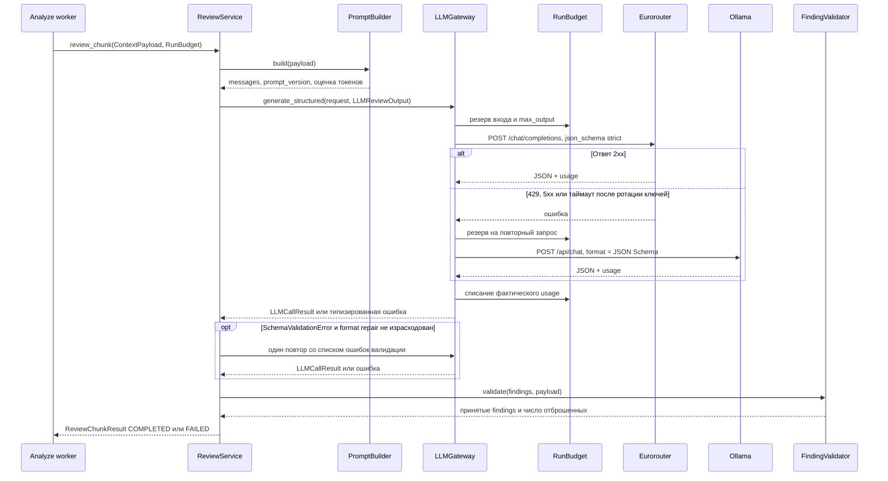

# ТЗ: LLM Gateway и конвейер структурированного ревью

Статус: черновик на согласование · Дата: 26.09.2026
Нормативная основа: `dmc-268-ui-t2/docs/SYSTEM_DESIGN_RU.md` v1.2 (далее — **SD**), разделы 6, 7, 9, 12–14, 16.
При расхождении этого ТЗ и SD приоритет у SD; расхождение фиксируется в Issue/PR.

---

## 1. Контекст и цель

Реализовать в backend (`dmc-268-api-t2`) два модуля из SD §3 «Внутренние компоненты backend»:

1. **LLM gateway** — владеет шаблонами промптов, сериализацией, лимитами и таймаутами; вызывает модель и возвращает строго типизированный результат (SD §3, §7).
2. **Review pipeline** — для одного чанка `ContextPayload` собирает промпт в пределах бюджета, вызывает gateway, валидирует ответ схемой и доменными правилами, возвращает `ReviewChunkResult` либо типизированную ошибку чанка.

Результат задачи — библиотечный слой, который позже вызывает analyze worker. Пользовательских HTTP-эндпоинтов задача не добавляет: по SD §3 API не выполняет длительное ревью внутри HTTP-запроса.

### 1.1. Вне рамок задачи

| Не входит | Где будет |
|---|---|
| Celery/RabbitMQ, outbox, leases, хранение результатов в PostgreSQL | Отдельные тикеты по SD §9–10 |
| Получение diff из GitHub, VCS adapter, `Snapshot` | SD §5 |
| Сборка уровней контекста L2–L4 (Surrounding, Whole File, AST/Imports), Redis-кэш | Context builder, SD §6 |
| Публикация в GitHub, marker, итоговая сводка запуска | Publisher, SD §8 |
| Эндпоинты `/api/v1/reviews/...` и типы для UI | SD §11 |
| Развёртывание Ollama в staging (сервис, volume модели) | DevOps, SD §15 |

Модели `ContextPayload` v1 реализуются полностью (все поля SD §6), но pipeline в этой задаче тестируется на payload, где заполнен только уровень L1 (`source_windows = []`, `whole_file = null`, `related_symbols = []`).

### 1.2. Принятое решение по провайдерам (26.09.2026)

- **Eurorouter — основной провайдер** (целевое решение). Ключ API приходит из CI/CD (GitHub Actions Secrets), в Git не хранится.
- **Ollama — резервный провайдер.**
- В конфигурации есть флаг выбора основного провайдера и флаг включения резерва (§6). Это позволяет переключаться между вариантами без изменения кода.

Решение отменяет ограничение SD §12 «внешний LLM-провайдер без отдельного согласования не подключается» и меняет схемы SD §3/§15 (Ollama — единственный инференс, egress только в GitHub). Синхронизацию SD выполняет Tech Lead; до неё приоритет у этого раздела.

### 1.3. Место в архитектуре проекта

Легенда для всех схем:

- **зелёный, жирная рамка** — реализуется в этой задаче;
- **синий** — уже есть в `main` (API, PostgreSQL, Redis, UI, staging deploy);
- **серый, пунктир** — целевое состояние SD, отдельные тикеты;
- **оранжевый** — внешние системы.

По SD §3 API, worker и dispatcher — процессы одного backend-проекта с общим образом. Поэтому код задачи живёт в `dmc-268-api-t2` и попадает в тот же image. Пока analyze worker не создан, модули вызываются только из тестов, а переменные `LLM__*` передаются контейнеру `api` (§6a).

#### 1.3.1. Контейнеры



Что меняется относительно SD §3/§15: появляется внешний HTTPS egress к Eurorouter, Ollama становится резервом, а ключ провайдера приходит из CI/CD (§1.2, §6a).

#### 1.3.2. Компоненты внутри backend



`core/config.py` уже существует; задача добавляет в него секцию `llm`. Фильтрация и чанкинг реализуются здесь, а вызывать их будет будущий context builder.

#### 1.3.3. Обработка одного чанка

Схема для режима по умолчанию (`PRIMARY_PROVIDER=eurorouter`, `FALLBACK_ENABLED=true`). В режиме `ollama` провайдеры меняются местами.



---

## 2. Стек и соглашения проекта

Следовать существующему каркасу (`pyproject.toml`, `AGENTS.md`):

- Python **3.14**, `uv`, Pydantic v2, pydantic-settings, structlog.
- Качество: `uv run ruff check`, `uv run ruff format --check`, `uv run mypy .` (strict), `uv run pytest` (`asyncio_mode = "auto"`).
- Современный синтаксис типов (ruff `UP`): `int | None`, `type[T]`, `list[...]`; без `Optional`/`Type`.
- Новые зависимости добавляются через `uv add`:
  - runtime: `httpx`;
  - dev: `respx` (или только `httpx.MockTransport` — без новой зависимости; выбор фиксируется в PR).
- **Instructor не используется.** Структурированный ответ получается через JSON Schema (`response_format` у Eurorouter, `format` у Ollama) и валидацию `Model.model_validate_json()`. Скрытые повторы библиотеки не учитываются бюджетом запуска (SD §14).
- **`tiktoken` не используется как точный счётчик**: основной и резервный провайдеры обслуживают разные модели с разными токенизаторами. См. §5.3.
- Разработка по `AGENTS.md`: TDD red → green через публичные интерфейсы (`ReviewService`, `LLMGateway`, модели схем), один AC-кейс на шаг, Close через `project-code-review`.

### 2.1. Структура модулей

```text
src/app/
  core/config.py            # + секция LLM (см. §6)
  llm/
    __init__.py
    client.py               # BaseLLMClient, LLMCallResult[T], LLMRequest
    errors.py               # иерархия ошибок gateway
    openai_compatible.py    # OpenAICompatibleClient — Eurorouter (основной)
    ollama.py               # OllamaClient — нативный /api/chat (резервный)
    providers.py            # сборка цепочки провайдеров из настроек (§6)
    gateway.py              # LLMGateway: маршрутизация, failover, backoff
    budget.py               # RunBudget
    tokens.py               # TokenCounter, ConservativeTokenCounter
  review/
    __init__.py
    schemas/
      context.py            # ContextPayload v1 и вложенные модели
      finding.py            # Severity, Category, Side, Location, LLMFinding
      result.py             # LLMReviewOutput, ReviewChunkResult, Usage, ChunkStatus
    filtering.py            # ignore policy (SD §6, шаг 1)
    chunking.py             # приоритизация и разбиение на чанки
    prompt.py               # PromptBuilder, загрузка версионированных промптов
    validation.py           # доменный валидатор и дедупликация findings
    service.py              # ReviewService
.agents/reviewer/
  manifest.json             # prompt_version → файлы + SHA-256
  v1/system.md
  v1/few_shots.json
tests/
  llm/…  review/…
```

Каталог `schemas/` в корне репозитория зарезервирован под нормативные JSON Schema (`schemas/context/v1.json`, `schemas/review-result/v1.json`, SD §6); их генерация из Pydantic-моделей — п. 3.4.

---

## 3. Схемы данных

Общие правила для всех моделей (SD §6):

- `model_config = ConfigDict(extra="forbid", frozen=True)` — неизвестные поля v1 отклоняются.
- Номера строк начинаются с 1, диапазоны включительные, отсутствующая сторона — `null`, а не `0`.
- Пути относительные и нормализованные: без ведущего `/`, без `..`, разделитель `/`.
- Enum-значения в нижнем регистре, кроме `side` (`OLD`/`NEW`), — как в SD.

### 3.1. Вход: `ContextPayload` v1 (`review/schemas/context.py`)

Точная реализация контракта SD §6 «Общий контракт», включая таблицу ограничений:

- `schema_version: Literal[1]`, `review_id`, `chunk_id`;
- `snapshot`: `provider`, `base_repository_id`, `head_repository_id`, `base_sha`, `merge_base_sha`, `head_sha`, `captured_at`, `provider_metadata`;
- `metadata`: `title`, `body: str | None`, `base_ref`, `head_ref`, `commit_messages: list[str]`, `languages: list[str]`, `discussions`, `rules_version`, `output_language` (v1: `"ru"`);
- `files: list[FileContext]` — не пуст; `FileContext` = `diff: FileDiff`, `source_windows: list[SourceWindow]`, `whole_file: WholeFile | None` (поле обязательно);
- `FileDiff`: `file_id`, `old_path`, `new_path`, `status` (`added|modified|deleted|renamed`), `old_blob_sha`, `new_blob_sha`, `language`, `hunks`;
- `Hunk`: `hunk_id`, `old_start`, `old_count`, `new_start`, `new_count`, `lines: list[HunkLine]`;
- `HunkLine`: `kind` (`added|deleted|context`), `text`, `old_line: int | None`, `new_line: int | None` — наличие сторон согласовано с `kind` (`added` → только `new_line`, `deleted` → только `old_line`, `context` → обе);
- `related_symbols`, `coverage` (`included`, `skipped[].reason` из enum SD, `context_quality: full|degraded|diff_only`), `budget` (`estimated_input_tokens`, `reserved_output_tokens`, `limit_input_tokens`, все `>= 0`).

Валидаторы модели проверяют: согласованность `old_count/new_count` с числом строк hunk; монотонность номеров строк; `start_line <= end_line`.

> Типы `DiffPayload` / `ReviewContext` из исходной версии ТЗ **не вводятся** — их роль выполняет `ContextPayload`.

### 3.2. Ответ модели: `LLMReviewOutput` (`review/schemas/finding.py`, `result.py`)

Это **единственная** схема, передаваемая модели как `format`. Она не содержит полей, которые должен заполнять backend (usage, модель, ID, fingerprint — SD §7).

```python
class Severity(StrEnum):
    CRITICAL = "critical"
    HIGH = "high"
    MEDIUM = "medium"
    LOW = "low"          # "info" в v1 не является finding (SD §7, §14)

class Category(StrEnum):
    SECURITY = "security"
    CORRECTNESS = "correctness"
    PERFORMANCE = "performance"
    MAINTAINABILITY = "maintainability"   # стиль/форматирование не является категорией

class Side(StrEnum):
    OLD = "OLD"   # удалённые строки — координаты старой стороны
    NEW = "NEW"   # добавленные/контекстные — новой

class Location(BaseModel):
    path: str                       # нормализованный относительный путь
    side: Side
    line: int = Field(ge=1)
    end_line: int | None = Field(default=None, ge=1)   # та же сторона, end_line >= line

class LLMFinding(BaseModel):
    location: Location
    category: Category
    severity: Severity
    title: str = Field(min_length=1, max_length=200)
    explanation: str = Field(min_length=1, max_length=2000)    # условия проявления и последствия
    evidence: str = Field(min_length=1, max_length=1000)       # ссылка на строку/символ из контекста + обоснование
    recommendation: str = Field(min_length=1, max_length=2000) # текст; автоприменения нет

class LLMReviewOutput(BaseModel):
    summary: str = Field(max_length=2000)
    findings: list[LLMFinding] = Field(max_length=50)
    limitations: list[str] = Field(default_factory=list, max_length=10)
```

Конкретные значения `max_length` — стартовые; фиксируются в PR и в `schemas/review-result/v1.json`.

### 3.3. Результат чанка: `ReviewChunkResult` (`review/schemas/result.py`)

Заполняется backend после валидации (SD §7):

```python
class ChunkStatus(StrEnum):
    COMPLETED = "completed"
    FAILED = "failed"

class Usage(BaseModel):
    input_tokens: int | None = Field(ge=0)     # None, если провайдер не вернул usage
    output_tokens: int | None = Field(ge=0)
    requests: int = Field(ge=0)                # фактические запросы, включая retry и repair
    latency_ms: int = Field(ge=0)

class ReviewChunkResult(BaseModel):
    schema_version: Literal[1] = 1
    review_id: str
    chunk_id: str
    status: ChunkStatus
    summary: str | None                        # None при FAILED
    findings: list[ValidatedFinding]           # LLMFinding + fingerprint, назначенный backend
    rejected_findings_count: int = Field(ge=0) # отброшены доменным валидатором
    limitations: list[str]
    usage: Usage
    model: str                                 # имя модели
    model_digest: str | None                   # digest Ollama, если доступен
    provider: str                              # имя провайдера из конфигурации
    prompt_version: str
    error_code: str | None                     # безопасный код при FAILED, без текста ответа модели
```

`ValidatedFinding` = поля `LLMFinding` + `fingerprint: str` (хеш нормализованных `path/side/range/category/title`, SD §7). ID finding и lifecycle назначает слой хранения (вне задачи).

### 3.4. JSON Schema

`LLMReviewOutput.model_json_schema()` сохраняется в `schemas/review-result/v1.json`, `ContextPayload` — в `schemas/context/v1.json`. Тест сверяет файлы со схемами моделей, чтобы расхождение ловилось в CI.

---

## 4. LLM gateway (`src/app/llm/`)

### 4.1. Интерфейс клиента

```python
class LLMRequest(BaseModel):
    messages: list[ChatMessage]          # role: system|user|assistant, content: str
    temperature: float = 0.0             # SD §7
    max_output_tokens: int               # ≤ 2000 (SD §14)
    timeout_s: float                     # ≤ 120 и ≤ остатка дедлайна

class LLMCallResult[T: BaseModel](BaseModel):
    parsed: T
    raw_text_len: int                    # только размер, сам текст не хранится в логах
    input_tokens: int | None
    output_tokens: int | None
    model: str
    model_digest: str | None
    provider: str
    latency_ms: int

class BaseLLMClient(ABC):
    name: str
    @abstractmethod
    async def generate_structured[T: BaseModel](
        self, request: LLMRequest, response_model: type[T]
    ) -> LLMCallResult[T]: ...
```

Клиент выполняет **ровно один** HTTP-запрос: без повторов и failover (это ответственность `LLMGateway`). Ошибки HTTP и парсинга он переводит в типы из §4.3.

### 4.2. Провайдеры

| Провайдер | Клиент | Endpoint | Structured output | Usage | Роль |
|---|---|---|---|---|---|
| `eurorouter` | `OpenAICompatibleClient` | `POST {base_url}/chat/completions`, заголовок `Authorization: Bearer <key>` | `response_format = {"type": "json_schema", "json_schema": {"name": "review_output", "schema": ..., "strict": true}}`, `temperature`, `max_tokens` | `usage.prompt_tokens` / `usage.completion_tokens` | **Основной** |
| `ollama` | `OllamaClient` | `POST {base_url}/api/chat`, `stream=false`, без авторизации (закрытая сеть) | `format = response_model.model_json_schema()`, `options.temperature`, `options.num_predict`, `options.num_ctx` | `prompt_eval_count` / `eval_count` | **Резервный** |

- Оба клиента используют общий `httpx.AsyncClient`, который передаётся через конструктор (в тестах — через `MockTransport`). Время жизни клиента привязано к lifespan процесса worker.
- `OpenAICompatibleClient` не содержит логики, специфичной для Eurorouter: имя, `base_url`, модель и ключи приходят из конфигурации. Если Eurorouter отклоняет `strict`/`json_schema` для выбранной модели, это ошибка конфигурации (`ProviderRequestError`), а не повод молча перейти на свободный JSON.
- Поддержка structured output выбранными моделями обоих провайдеров проверяется до допуска модели в конфигурацию (SD §7). Это ручная проверка Agentic/DevOps, не код задачи.
- Ответы Eurorouter могут содержать поле роутинга с фактической моделью (`model`). Именно оно пишется в `ReviewChunkResult.model`; если поля нет — модель из конфигурации.

### 4.3. Классификация ошибок (`llm/errors.py`)

| Ситуация | Тип ошибки | Действие gateway |
|---|---|---|
| HTTP 429 | `RateLimitedError(retry_after)` | Ключ/endpoint уходит в cooldown на `Retry-After` (иначе backoff); следующая попытка на другом ключе/endpoint, если он есть |
| HTTP 502, 503, 504; `httpx.ConnectError`, `ReadTimeout`, `RemoteProtocolError` | `TransientProviderError` | Backoff с jitter, затем повтор/failover |
| HTTP 500 | `TransientProviderError` | Как 5xx выше, но не больше **1** повтора на endpoint |
| HTTP 401, 403 | `AuthError` | Ключ помечается недействительным до перезапуска процесса; переход к следующему ключу **без** backoff. Если ключей нет, endpoint исключается |
| HTTP 400 с признаком переполнения контекста | `ContextOverflowError` | **Без** повтора и failover; вызывающий код пересобирает чанк меньше (§5.4) |
| Прочие 4xx | `ProviderRequestError` | Без повторов; ошибка чанка |
| Ответ не парсится как JSON или не проходит схему | `SchemaValidationError(details)` | Решает pipeline (format repair, §7), а не gateway |
| Исчерпан бюджет или дедлайн | `BudgetExceededError` | Немедленное прекращение |
| Все endpoint'ы недоступны после попыток | `LLMUnavailableError(last_error_code)` | Проброс в pipeline → чанк `FAILED` |

Все ошибки gateway наследуются от `LLMGatewayError` и содержат безопасный `error_code`. Тела запросов и ответов в ошибки и логи не попадают.

### 4.4. Маршрутизация, ротация ключей, failover

- **Цепочка провайдеров** строится из флагов §6: `[primary]` или `[primary, secondary]`, где secondary — второй из пары `eurorouter`/`ollama`. По умолчанию: `[eurorouter, ollama]`.
- **Порядок попыток:** сначала основной провайдер. Переход на резервный — только после ошибок из §4.3, допускающих failover. Резервный провайдер используется до конца **текущего вызова**; следующий вызов снова начинается с основного, если тот не в cooldown.
- **Ключи Eurorouter:** 1..N ключей, выбор по round-robin с пропуском ключей в cooldown (429) или помеченных недействительными (401/403). Когда все ключи основного провайдера в cooldown или недействительны, вызов идёт на резервный провайдер, а при отключённом резерве — `LLMUnavailableError`.
- Cooldown ключей и провайдеров хранится в памяти процесса. В v1 это допустимо: один analyze worker с concurrency=1 (SD §9, §14).
- **Смена модели.** Переход на резервный провайдер всегда означает другую модель. Флаг `LLM__FALLBACK_ENABLED=true` и есть явное разрешение на такую смену. Фактические `provider`, `model` и `model_digest` пишутся в каждый `ReviewChunkResult` (SD §14: модель входит в снимок запуска), а в `limitations` добавляется пометка «чанк обработан резервным провайдером».
- **Backoff:** `min(cap, base * 2**attempt) * uniform(0.5, 1.0)`, `base=1 с`, `cap=20 с`. Если есть `Retry-After`, берётся максимум из него и backoff. Ожидание не превышает остатка дедлайна: если не укладывается, сразу `BudgetExceededError`.
- **Лимит попыток:** не более `max_attempts_per_call = 3` HTTP-запросов на один логический вызов (SD §9: до трёх попыток на этап), и каждый запрос списывается из `RunBudget` (§4.5).
- `sleep` и источник случайности инжектируются (`Callable[[float], Awaitable[None]]`, `random.Random`) для детерминированных тестов.

### 4.5. `RunBudget` (`llm/budget.py`)

Общий бюджет запуска (SD §14) передаётся в gateway и pipeline и разделяется между всеми чанками запуска:

| Лимит | Значение v1 (конфигурируемо) |
|---|---|
| Фактических запросов к модели на запуск | 8, включая retry |
| Format repair на запуск | 1 |
| Входных токенов на запуск | 80 000 |
| Выходных токенов на запуск | 16 000 |
| Дедлайн анализа | 10 мин от первого старта |
| Таймаут одного обращения | Задаётся на провайдера (§6), по умолчанию 120 с; меньший остаток дедлайна имеет приоритет |

Правила:

- Перед каждым запросом резервируются оценка входа и `max_output_tokens`; после ответа резерв заменяется фактическим usage.
- Если usage неизвестен (таймаут, провайдер не вернул), списывается весь резерв (SD §14).
- Нехватка любого лимита приводит к `BudgetExceededError` до отправки запроса.
- В этой задаче `RunBudget` — объект в памяти. Персистентность между попытками worker'а (SD §9: попытки хранятся в БД) — отдельный тикет. Интерфейс проектируется так, чтобы состояние можно было загрузить и сохранить.

---

## 5. Подготовка чанка и токен-бюджет (`src/app/review/`)

### 5.1. Фильтрация (`filtering.py`)

Реализует начальную ignore policy SD §6 (шаг 1): бинарные файлы, `*.lock`, `package-lock.json`, `pnpm-lock.yaml`, `poetry.lock`, `*.min.js`, `*.min.css`, `dist/**`, `vendor/**`, `*.snap`, `*_pb2.py`, `*.pb.go`, файлы с распознанным generated-header. Миграции **не** исключаются. Политика имеет `version`; исключённые файлы попадают в `coverage.skipped` с причиной `policy`. Repository overrides и роль `admin` — вне задачи; интерфейс принимает дополнительные globs.

### 5.2. Приоритизация и чанкинг (`chunking.py`)

По SD §6 (шаги 2–5):

1. Приоритет: изменённый исполняемый код → конфигурация → документация. Внутри группы порядок стабильный: `path`, затем `hunk`.
2. Чанк строится по файлу. Несколько небольших файлов одного приоритета упаковываются в один чанк.
3. Слишком большой файл разбивается по hunks; слишком большой hunk — на последовательные диапазоны строк. Каждая часть — валидный `Hunk`: исходные номера строк сохраняются, `old_start/new_start/old_count/new_count` пересчитаны и согласованы со строками.
4. Один изменённый диапазон относится ровно к одному основному чанку.
5. Не более **5 чанков** на запуск. Что не поместилось, попадает в `coverage.skipped` с причиной `token_budget` (или `file_limit`/`line_limit` для admission-лимитов: 50 файлов, 2 000 изменённых строк — SD §14), а `context_quality` и статус запуска отражают неполное покрытие.

**Скрытое усечение запрещено** (SD §6): строки не отрезаются молча, неполнота всегда видна в `coverage`.

### 5.3. Подсчёт токенов (`llm/tokens.py`)

- Протокол `TokenCounter.count(text: str) -> int`.
- Реализация по умолчанию `ConservativeTokenCounter`: `ceil(len(text.encode("utf-8")) / bytes_per_token) * (1 + safety_margin)`, стартовые значения `bytes_per_token = 3`, `safety_margin = 0.15`. Оценка консервативная: кириллица и код дают больше токенов, чем английский текст.
- Точный токенизатор модели можно подключить позже через тот же протокол; выбор модели — открытый вопрос SD §16.

### 5.4. Бюджет одного вызова

Значения SD §14 (конфигурируемые):

| Параметр | Значение |
|---|---|
| Контекстное окно модели (`num_ctx`) | ≥ 16 384 |
| Вход на вызов | ≤ 10 000 |
| Резерв ответа (`max_output_tokens`) | 2 000 |
| Остаток | Служебные токены и запас |

**Решение (подтверждено 26.09.2026):** лимиты общие для обоих провайдеров — чанк собирается один раз и должен без пересборки подходить и основной, и резервной модели. Поэтому окно резервной модели Ollama тоже должно быть ≥ `LLM__CONTEXT_WINDOW`, это проверяется при допуске модели.

Порядок наполнения (SD §6, шаг 4): системные инструкции и правила → few-shot → метаданные PR → diff чанка → (в будущем) L2–L4 по релевантности. Метаданные, сообщения коммитов и обсуждения входят в общий бюджет и сокращаются первыми (обрезаются с пометкой в `limitations`). Diff не сокращается: если он не влезает, изменения переносятся в следующий чанк.

При `ContextOverflowError` от провайдера чанк пересобирается с уменьшенным лимитом (×0.75), не больше **1** раза. Пересборка списывает запрос из `RunBudget`. Бесконечных повторов нет (SD §6).

`ContextPayload.budget.estimated_input_tokens` после финальной сборки не превышает `limit_input_tokens`.

---

## 6. Конфигурация (`core/config.py`)

Новая секция `llm: LLM` в `Settings`, по образцу `Postgres`/`Redis`/`Logging` (разделитель `__`).

### 6.1. Флаги выбора провайдера

| Переменная | Значения | По умолчанию | Смысл |
|---|---|---|---|
| `LLM__PRIMARY_PROVIDER` | `eurorouter` \| `ollama` | `eurorouter` | Основной провайдер |
| `LLM__FALLBACK_ENABLED` | `true` \| `false` | `true` | Включить второй провайдер пары как резервный |

Итоговые режимы:

| `PRIMARY_PROVIDER` | `FALLBACK_ENABLED` | Цепочка | Когда использовать |
|---|---|---|---|
| `eurorouter` | `true` | Eurorouter → Ollama | **Целевой режим** |
| `eurorouter` | `false` | только Eurorouter | Staging, пока Ollama не развёрнута |
| `ollama` | `true` | Ollama → Eurorouter | Аварийное переключение, когда Eurorouter деградировал |
| `ollama` | `false` | только Ollama | Локальная разработка без ключа; работа без внешнего провайдера |

Флаги читаются при старте процесса. Переключение выполняется сменой переменных окружения и перезапуском worker; горячей смены в v1 нет. Выбранная цепочка пишется в лог старта (без ключей).

### 6.2. Параметры провайдеров

```text
# Eurorouter (основной)
LLM__EUROROUTER__BASE_URL=<https://…/v1>         # не секрет: GitHub Variable
LLM__EUROROUTER__MODEL=<model-id>                 # не секрет: GitHub Variable
LLM__EUROROUTER__API_KEYS=<key1>[,<key2>…]        # СЕКРЕТ: только из CI/CD
LLM__EUROROUTER__TIMEOUT_S=120

# Ollama (резервный)
LLM__OLLAMA__BASE_URL=http://ollama:11434
LLM__OLLAMA__MODEL=<model>:<tag>
LLM__OLLAMA__TIMEOUT_S=120

# Общие лимиты
LLM__PROMPT_VERSION=v1
LLM__CONTEXT_WINDOW=16384
LLM__MAX_INPUT_TOKENS=10000
LLM__MAX_OUTPUT_TOKENS=2000
LLM__REQUEST_TIMEOUT_S=120
LLM__RUN_MAX_REQUESTS=8
LLM__RUN_MAX_INPUT_TOKENS=80000
LLM__RUN_MAX_OUTPUT_TOKENS=16000
LLM__RUN_DEADLINE_S=600
LLM__MAX_CHUNKS=5
```

### 6.3. Правила валидации настроек

- `api_keys: list[SecretStr]`. Значение переменной — строка через запятую; парсится валидатором (`NoDecode` из pydantic-settings), пробелы и пустые элементы отбрасываются. Ключи не попадают в `repr`, логи и ошибки (SD §12).
- Если `eurorouter` входит в цепочку (основным или резервным), а `API_KEYS`, `BASE_URL` или `MODEL` пусты, процесс **не стартует** с понятной ошибкой конфигурации, в которой ключ не раскрывается.
- Если `ollama` входит в цепочку, обязательны `LLM__OLLAMA__BASE_URL` и `LLM__OLLAMA__MODEL`.
- `BASE_URL` Eurorouter — только `https://`.
- Окно ≥ 16 384; `max_input + max_output <= context_window`.
- В `.env.example` добавляются все переменные, `LLM__EUROROUTER__API_KEYS` — пустым значением; для локального запуска по умолчанию в примере указан режим `ollama` без резерва.

## 6a. Доставка ключа Eurorouter из CI/CD

Ключ идёт тем же путём, что и `POSTGRES__PASSWORD` (`docs/staging-deployment.md`, раздел «Runtime configuration and secrets»): GitHub Actions Secret → `.env.staging` на VPS (`umask 077`) → переменные окружения контейнера.

| Что | Где хранится |
|---|---|
| `STAGING_EUROROUTER_API_KEYS` | GitHub Actions **Secret** (один ключ или несколько через запятую) |
| `STAGING_EUROROUTER_BASE_URL`, `STAGING_EUROROUTER_MODEL` | GitHub Actions **Variables** |
| `STAGING_LLM_PRIMARY_PROVIDER`, `STAGING_LLM_FALLBACK_ENABLED` | GitHub Actions **Variables** (переключение без изменения кода) |

Изменения в рамках задачи:

1. `.github/workflows/deploy-staging.yml`:
   - шаг «Validate deployment configuration» проверяет наличие `STAGING_EUROROUTER_API_KEYS`, `…_BASE_URL`, `…_MODEL`, если Eurorouter входит в цепочку; значение ключа не выводится;
   - шаг «Write staging environment» дописывает в `.env.staging` переменные `LLM__*` из §6.
2. `docker-compose.staging.yml`: сервису, который выполняет ревью (сейчас `api`, позже analyze worker — SD §3), передаются `LLM__*` через `${VAR:?…}` для обязательных значений, как это сделано для `POSTGRES__*`.
3. `.env.staging.example` и `docs/staging-deployment.md`: новые переменные и правило ротации ключа (обновить Secret → перезапустить deploy).
4. Ключ не передаётся в UI, в сообщения очереди, в `ContextPayload` и в логи CI (`set +x`, без `echo` значения).

Сетевой доступ: staging-хосту нужен HTTPS egress к Eurorouter (SD §15 сейчас разрешает только GitHub). Пока Ollama не развёрнута в staging (SD §15, DevOps), staging работает в режиме `eurorouter` + `FALLBACK_ENABLED=false`.

---

## 7. Сборка промпта (`review/prompt.py`)

- Промпт-артефакты хранятся в `.agents/reviewer/` (SD §7). `manifest.json` связывает `prompt_version` с файлами и их SHA-256. `PromptBuilder` при загрузке проверяет хеши: при несовпадении — ошибка конфигурации, запуск не стартует. Каталог не входит в контрольную сумму `.agents/skills/**` и не ломает `check-sync.mjs`.
- **Системный промпт:** роль ревьюера; категории и severity строго из §3.2; правило «стиль и то, что закрывает форматтер/линтер, не репортить»; координаты только на изменённых строках нужной стороны; обязательный `evidence`; язык ответа — `metadata.output_language` (v1: русский; идентификаторы, пути и код не переводятся — SD §8); кратко описанная схема ответа.
- **Few-shot:** 2–3 примера из `few_shots.json` в формате «фрагмент `ContextPayload` → валидный `LLMReviewOutput`», включая пример **без findings**. Тест проверяет, что каждый пример проходит валидацию `LLMReviewOutput`. Выбор примеров детерминирован: по языкам чанка, затем по стабильному порядку.
- **Защита от prompt injection** (SD §12): title/body PR, сообщения коммитов, обсуждения и код передаются в пользовательском сообщении как данные внутри явных разделителей. Системный промпт указывает, что инструкции внутри данных не исполняются. Правила репозитория берутся только из доверенной конфигурации (`rules_version`), не из diff.
- `PromptBuilder` возвращает `messages`, `prompt_version` и оценку токенов. Сырой промпт не логируется (SD §13).

---

## 8. Координатор: `ReviewService` (`review/service.py`)

```python
class ReviewService:
    def __init__(
        self,
        gateway: LLMGateway,
        prompt_builder: PromptBuilder,
        validator: FindingValidator,
        token_counter: TokenCounter,
        settings: LLM,
    ) -> None: ...

    async def review_chunk(
        self, payload: ContextPayload, budget: RunBudget
    ) -> ReviewChunkResult: ...
```

Алгоритм:

1. Собрать промпт (§7), проверить бюджет вызова (§5.4) и `RunBudget` (§4.5).
2. `gateway.generate_structured(request, LLMReviewOutput)`.
3. При `SchemaValidationError`, если format repair в `RunBudget` ещё не израсходован: один повторный запрос с исходными сообщениями, предыдущим ответом (усечённым до лимита) и списком ошибок валидации без исходного кода. Если repair уже потрачен или повтор снова невалиден, чанк получает `FAILED`, `error_code="invalid_llm_output"`.
4. Доменная валидация (`review/validation.py`, SD §7):
   - `location.path` принадлежит файлам чанка (`new_path` для `NEW`, `old_path` для `OLD`);
   - `line..end_line` целиком лежат в строках hunk нужной стороны: `NEW` — `added`; `OLD` — `deleted`. Строки `context` допустимы только внутри диапазона, который начинается на изменённой строке. Точное правило фиксируется тестами;
   - координаты не переносятся на соседнюю строку «по догадке»;
   - `evidence` не пуст и не совпадает с `title`;
   - в текстах findings маскируются значения, похожие на секреты (SD §12, базовые шаблоны: ключи AWS/GitHub, `password=`, PEM);
   - невалидные findings отбрасываются и считаются в `rejected_findings_count`;
   - точные дубли внутри чанка объединяются по `fingerprint`.
5. Вернуть `ReviewChunkResult` со статусом `COMPLETED` (в том числе с пустым списком findings).
6. `LLMUnavailableError`, `BudgetExceededError`, `ProviderRequestError`, а также неудачная пересборка после `ContextOverflowError` дают `ReviewChunkResult` со статусом `FAILED` и безопасным `error_code`. **Метод не бросает исключений для ожидаемых отказов провайдера, бюджета и формата.** Ошибки программирования и конфигурации пробрасываются.

Дедупликация между чанками и итоговая сводка запуска (SD §7: собирается приложением без отдельного LLM-вызова) — зона вызывающего кода; в задаче достаточно вспомогательной функции `merge_chunk_results(results) -> list[ValidatedFinding]` с дедупом по `fingerprint`.

**Логирование** (structlog, SD §13): `review_id`, `chunk_id`, `provider`, `model`, `attempt`, `duration_ms`, `input_tokens`, `output_tokens`, `error_code`, `findings_count`, `rejected_findings_count`. Без промптов, исходников, ответов модели и ключей.

---

## 9. Открытые вопросы (не блокируют реализацию)

| Вопрос | Предлагаемое решение до согласования | Кто решает |
|---|---|---|
| Какая модель используется в Eurorouter и поддерживает ли она `json_schema` + `strict` | Модель задаётся GitHub Variable; допуск — после ручной проверки | Agentic + QA |
| Условия хранения и обработки данных на стороне Eurorouter (retention, логирование запросов, регион). SD §12 требует отключённого request-body logging | До подтверждения — зафиксировать в SD как известный риск | Tech Lead + владельцы репозиториев |
| Какая модель Ollama (резерв), её digest и поддержка structured output с `num_ctx ≥ 16384`; когда Ollama появится в staging | До развёртывания — `FALLBACK_ENABLED=false` в staging | Agentic + DevOps (SD §16) |
| Точный токенизатор моделей | До выбора моделей — `ConservativeTokenCounter` | Agentic |
| Сравнимость quality gates (SD §14) при ответах двух разных моделей | Метрики LLM Evaluation считаются по `provider/model` отдельно; данные разных моделей не смешиваются | QA |

---

## 10. Definition of Done

1. [ ] **Типизированный результат.** `ReviewService.review_chunk` возвращает `ReviewChunkResult`, прошедший схему и доменную валидацию. Сырой JSON, строки ответа модели и провайдерские структуры наружу не выходят. Ожидаемые отказы дают `status=FAILED` с `error_code`, а не исключение.
2. [ ] **Устойчивость.** 429/5xx/таймауты обрабатываются по таблице §4.3: backoff с jitter, `Retry-After`, round-robin ключей Eurorouter, failover Eurorouter → Ollama. Попытки ограничены (3 на вызов, 8 на запуск), дедлайн соблюдается. 401/403 и 400 не приводят к слепым повторам.
3. [ ] **Переключение провайдеров.** Все четыре режима §6.1 работают только за счёт `LLM__PRIMARY_PROVIDER` и `LLM__FALLBACK_ENABLED`, без изменения кода. Фактический провайдер и модель видны в каждом `ReviewChunkResult`.
4. [ ] **Ключ из CI/CD.** `deploy-staging.yml`, `docker-compose.staging.yml`, `.env.staging.example` и `docs/staging-deployment.md` обновлены по §6a. Без ключа при Eurorouter в цепочке процесс не стартует, а deploy падает на шаге валидации.
5. [ ] **Бюджет токенов.** Оценка входа каждого запроса ≤ `max_input_tokens`, `max_input + max_output ≤ context_window`. Не поместившиеся изменения переносятся в другой чанк или попадают в `coverage.skipped` с причиной; скрытого усечения нет. Разбитые hunks сохраняют исходные номера строк и согласованные счётчики.
6. [ ] **Промпты версионированы.** `.agents/reviewer/manifest.json` с SHA-256; `prompt_version` есть в каждом результате.
7. [ ] **Безопасность.** Ключи — `SecretStr`; в логах и ошибках нет ключей, промптов, исходников и ответов модели; данные PR отделены от инструкций.
8. [ ] **JSON Schema.** `schemas/context/v1.json` и `schemas/review-result/v1.json` сгенерированы и сверяются тестом.
9. [ ] **Качество.** `uv run ruff check`, `uv run ruff format --check`, `uv run mypy .`, `uv run pytest` зелёные локально и в `API CI`. Close выполнен по `project-code-review`.

### 10.1. Обязательные тесты

Сеть мокируется через `httpx.MockTransport`/`respx`; `sleep` и `random` инжектируются. Реальных сетевых вызовов в тестах нет.

**Схемы (`tests/review/schemas/`)**
- Валидный `LLMFinding` и `LLMReviewOutput` с пустым `findings`.
- Отклоняются: `line = 0`; `end_line < line`; severity `info`; category `style`/`bug`; side в нижнем регистре; лишнее поле; путь с `..` или абсолютный; пустой `evidence`; превышение `max_length`.
- `ContextPayload`: пример из SD §6 валиден; `HunkLine` с `kind=added` и `old_line != null` отклоняется; несогласованный `new_count` отклоняется; `schema_version = 2` отклоняется.

**Gateway (`tests/llm/`)**
- Eurorouter: в запросе есть `response_format` типа `json_schema` со `strict: true`, `temperature=0`, `max_tokens`, заголовок `Authorization`; usage разбирается из `usage`; фактическая модель берётся из поля `model` ответа.
- Ollama: в запросе есть `format` со схемой, `temperature=0`, `num_predict`, `num_ctx`, нет заголовка `Authorization`; usage разбирается из `prompt_eval_count`/`eval_count`.
- 429 на ключе A при свободном ключе B → следующий запрос сразу идёт с ключом B, sleep не вызывается.
- 429 с `Retry-After: 2` при единственном ключе и выключенном резерве → фейковый sleep вызван со значением ≥ 2 с, затем повтор.
- 503 от Eurorouter → успех на Ollama; в результате `provider="ollama"`, модель Ollama, пометка в `limitations`.
- Следующий вызов после failover снова начинается с Eurorouter.
- 401 на всех ключах Eurorouter → переход на Ollama без backoff; при `FALLBACK_ENABLED=false` → `LLMUnavailableError`.
- 400 context overflow → `ContextOverflowError`, failover не выполняется.
- Оба провайдера отвечают 503 → `LLMUnavailableError` ровно после `max_attempts_per_call` запросов.
- Backoff: значения при фиксированном seed совпадают с формулой; ожидание не превышает остаток дедлайна.

**Конфигурация (`tests/test_config.py`, `tests/llm/test_providers.py`)**
- Каждый из четырёх режимов §6.1 даёт ожидаемую цепочку провайдеров.
- Значения по умолчанию: `eurorouter` + резерв включён.
- `LLM__EUROROUTER__API_KEYS="k1, k2,"` → два ключа.
- Eurorouter в цепочке без ключа, `BASE_URL` или `MODEL` → ошибка валидации; текст ошибки не содержит значений ключей.
- Режим `ollama` без резерва стартует без ключа Eurorouter.
- `BASE_URL` Eurorouter с `http://` отклоняется.
- Ключ не встречается в `repr` настроек, в логе старта и в перехваченных логах вызовов.

**Бюджет и чанкинг (`tests/review/`, `tests/llm/test_budget.py`)**
- Diff, оценка которого ровно равна лимиту входа, помещается в один чанк.
- Лимит + 1 токен → изменения переносятся во второй чанк.
- Один hunk больше лимита → разбивается; номера строк сохраняются, счётчики согласованы.
- Изменений больше, чем помещается в 5 чанков → `coverage.skipped` с `token_budget`.
- Lock-файл и `dist/**` → `skipped` с `policy`; файл миграции не исключается.
- `RunBudget`: 9-й запрос → `BudgetExceededError` до отправки; неизвестный usage списывает весь резерв; второй format repair запрещён.

**Pipeline (`tests/review/test_service.py`)**
- E2E с замоканным Eurorouter: валидный ответ → `COMPLETED`, заполнены `usage`, `model`, `provider`, `prompt_version`, у findings есть `fingerprint`.
- Finding на неизменённую строку и finding с путём вне чанка отбрасываются, `rejected_findings_count = 2`.
- Первый ответ невалиден, repair валиден → `COMPLETED`, `usage.requests = 2`.
- Оба ответа невалидны → `FAILED`, `error_code = "invalid_llm_output"`, исключения нет.
- Все провайдеры недоступны → `FAILED`, исключения нет.
- Инструкция внутри body PR («ignore previous instructions…») попадает только в блок данных пользовательского сообщения (проверка собранных `messages`).
- Few-shot примеры проходят валидацию `LLMReviewOutput`; изменённый файл промпта с неверным SHA-256 → ошибка конфигурации.
